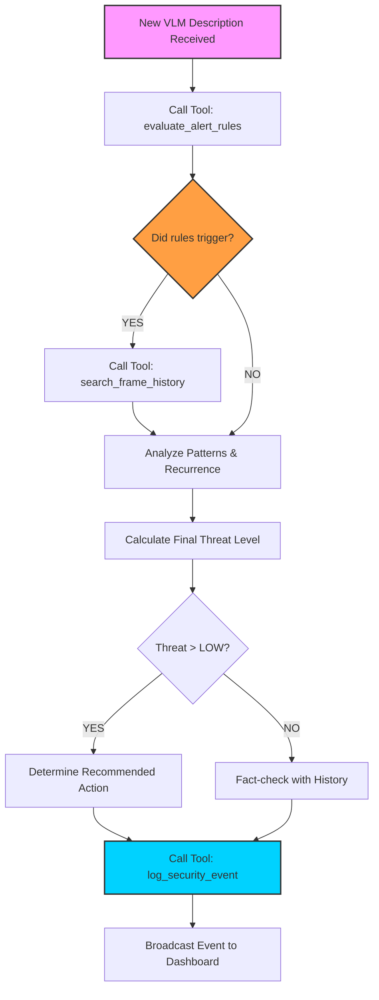

# 🤖 AI Agent Reasoning Workflow

This flowchart illustrates the step-by-step logic used by the **Security Analyst Agent (Qwen3)** when processing a new observation from the drone's Vision model.

### **Reasoning Stages:**
1.  **Perception Processing:** The agent receives a natural language description (e.g., *"A red sedan is parked in front of the main gate"*).
2.  **Tool Orchestration:** The agent doesn't just guess; it uses `evaluate_alert_rules` to check against deterministic security parameters.
3.  **Temporal Context:** It uses `search_frame_history` to see if this object has been seen before. This allows the agent to distinguish between a "Delivery" (seen once) and "Loitering" (seen multiple times).
4.  **Actionable Intelligence:** The final output isn't just data—it's a recommendation (e.g., *"Dispatch security personnel for ID check"*).
