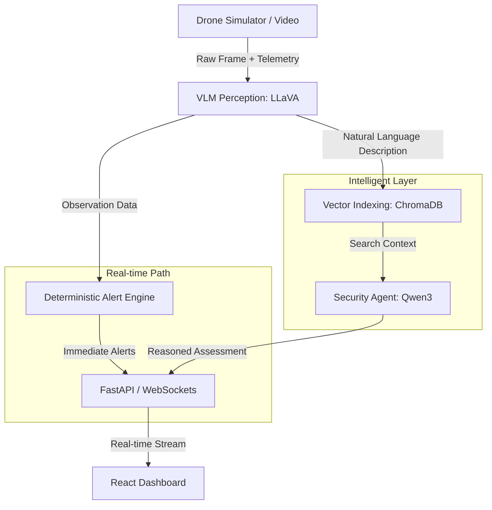

# 🏗️ System Architecture & Design Rationale

## 1. High-Level Architecture
The Drone Security Analyst Agent (DSAA) is built on a **7-Layer Multimodal Pipeline**. This architecture separates high-speed perception from deep-reasoning intelligence.

---

## 2. Design Decisions

### **A. Decoupled Alerting (Fast-Path vs. Slow-Path)**
*   **Decision:** We separated the Alert Engine from the AI Agent.
*   **Rationale:** Large Language Models (LLMs) can be slow (latency). Security systems cannot wait 30 seconds for a "thinking" process to finish before alerting a perimeter breach.
*   **Solution:** The **Fast-Path** (Rule Engine) triggers alerts in milliseconds. The **Slow-Path** (Agent) then provides the "Why" and historical context later.

### **B. Vector-First History**
*   **Decision:** Use ChromaDB as the primary memory.
*   **Rationale:** Traditional SQL databases are poor at searching "vague" visual descriptions.
*   **Solution:** By storing descriptions as vectors, the operator can search for *"anything suspicious"* or *"white vans"* using semantic meaning rather than exact keywords.

### **C. "Turbo Mode" Optimization**
*   **Decision:** Added a bypass for deep agent reasoning during demo sessions.
*   **Rationale:** In a live demonstration, visual fluidness is prioritized over deep background reasoning.
*   **Solution:** Turbo Mode ensures the UI updates the video feed instantly after VLM analysis.

---

## 3. Data Flow & Problem Solving Process

### **Scenario: Midnight Intruder Detection**
1.  **Ingestion:** `VideoSimulator` grabs frame #405 and GPS data.
2.  **Perception:** `LLaVA` describes: *"A person in dark clothing is climbing a fence at the back perimeter."*
3.  **Alerting:** `AlertEngine` sees `Object: Person` + `Location: Perimeter` + `Time: 02:00 AM`. It immediately broadcasts a **CRITICAL** alert.
4.  **Memory:** `ChromaDB` stores the vector: *"Person climbing fence..."*
5.  **Reasoning:** `SecurityAgent` searches history, finds that this fence was checked 10 minutes ago, and logs a comprehensive security event.
6.  **UI Visualization:** Dashboard pulses Red, shows the frame, and lists the historical context.

---

## 4. AI Tools Integration & Impact
| Tool | Impact on Development |
| :--- | :--- |
| **Antigravity (AI Assistant)** | Accelerated development by generating robust Python scripts, fixing WebSocket data-mapping bugs, and designing the premium UI system. |
| **Ollama** | Enabled **local-first** AI processing, ensuring security data never leaves the user's machine (Crucial for a "Security Analyst" agent). |
| **LangGraph** | Provided the "Stateful Brain" for the agent, allowing it to remember past frames during a session. |
| **Lucide React** | Allowed for a professional, tactical iconography set that enhances the "Premium Analyst" feel. |
